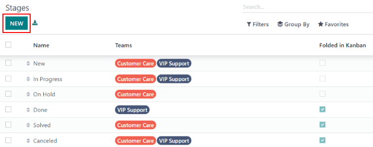

===============
Getting Started
===============

Odoo :guilabel:`Helpdesk` is a ticket based customer support platform. Teams can track, prioritize,
and solve customer issues from their pipeline, which is organized in customizable stages. Multiple
teams can be configured and managed in one dashboard.

Setting up teams
================

Setting up multiple teams allows for tickets to be grouped by location or by support type.

To view or modify Helpdesk teams, go to :menuselection:`Helpdesk --> Configuration --> Teams`.
To create a new team, click on the :guilabel:`New` button in the top left of the dashboard. From
there, name the new team, and fill out the remaining fields as defined in the following sections.

.. image:: getting_started/helpdesk-teams-list.png
   :align: center
   :alt: View of the helpdesk teams page in Odoo Helpdesk

Assignment & Visibility
-----------------------

Determine to whom the team will be visible
~~~~~~~~~~~~~~~~~~~~~~~~~~~~~~~~~~~~~~~~~~

Under the :guilabel:`Visibility` section, determine who can view this team and its tickets.

- :guilabel:`Invited internal users` have access to the team and tickets they are following. This
  can be modified on each individual ticket.
- :guilabel:`All internal users` have access to the team and all of its tickets without being a
  follower.
- :guilabel:`Invited portal users and all internal users` have access to the team without being a
  follower. Portal users will only be able to access tickets that they are following.

.. example::
   A `Customer Support` team intended to handle general issues with shipping and product issues
   would have the visibility setting :guilabel:`Invited portal users and all internal users`.
   However, a `Financial Services` team handling tickets related to accounting or tax information
   would only need to be visible to :guilabel:`Invited internal users`.

Automatically assign new tickets
~~~~~~~~~~~~~~~~~~~~~~~~~~~~~~~~

When tickets are received, they will need to be assigned to a member of the support team. This can
be done manually on each ticket individually, or through :guilabel:`Automatic Assignment`.
Check the box next to :guilabel:`Automatic Assignment` to enable the feature for this team.

         in Odoo Helpdesk

Select one of the following assignment methods.

- :guilabel:`Each user is assigned an equal number of tickets`.
- :guilabel:`Each user has an equal number of open tickets`.

Next, add the :guilabel:`Team Members` who will be assigned tickets for this team. Leave the field
empty to include all employees (with the proper access rights).

.. note::
   If an employee has time off scheduled in the :guilabel:`Time Off` application, they will not be
   assigned tickets during that time. If no employees are available, the system will look ahead until
   there is a match.

Setting up stages
=================

:guilabel:`Stages` are used to organize the Helpdesk pipeline and track the progress of tickets.
Stages are customizable, and can be renamed to fit the needs of each team.

To view or modify Helpdesk stages, go to :menuselection:`Helpdesk --> Configuration --> Stages`.

.. important::
   :doc:`Developer mode</applications/general/developer_mode>` must be activated in order to access
   the stages menu. To activate developer mode go to
   :menuselection:`Settings --> General Settings --> Developer Tools` and click on
   :guilabel:`Activate the developer mode`.

The list view shows an overview of all the stages currently available in Helpdesk. They are listed
in the order they appear in the pipeline. To change the order of the stages, use the arrow buttons
on the left side of the list.

.. tip::
   Change the stage order on the kanban view by dragging and dropping individual columns.

To create a new stage, click on the :guilabel:`New` button in the top left of the dashboard.
Next, choose a name for the new stage, and add a description (though it is not required).
Fill out the remaining fields following the steps below.

Add email and SMS templates to stages
-------------------------------------

When an :guilabel:`Email Template` is added to a stage, an email is automatically sent to the
the customer when a ticket reaches the stage. An :guilabel:`SMS Template` will result in an
SMS text message sent to the customer.

.. important::
   SMS Text Messaging is an In-App Purchase (IAP) service that requires prepaid credits to work.
   Refer to :doc:`SMS Pricing and FAQ
   </applications/marketing/sms_marketing/pricing/pricing_and_faq>`
   for additional information.

To select an existing email template, select it from the :guilabel:`Email Template` field. Click on
the arrow key to the right of the field to edit the template.

To create a new template, click the field and begin typing a new template title. Then select
:guilabel:`Create and edit`.

Follow the same steps to select, edit, or create an :guilabel:`SMS Template`.

.. image:: getting_started/sms-template.png
   :align: center
   :alt: View of an SMS template setup page in Odoo Helpdesk

Assigning stages to a team
--------------------------

Make a selection in the :guilabel:`Teams` field. More than one team may be selected, as stages
can be shared among multiple teams.

 .. image:: getting_started/stages-settings-sharing.png
   :align: center
   :alt: View of stage setup emphasizing teams field

.. example::
   In the setup below, the stages `New`, `In Progress`, and `Canceled` are shared between the
   `Customer Care` and `VIP Support` teams. The other teams are only available to one of the two
   teams.

  .. image:: getting_started/stages-sharing.png
   :align: center
   :alt: View of stages list in Helpdesk showing shared stages

Fold a stage
------------

Check the :guilabel:`Folded in Kanban` box to display this stage as *folded* by default in the
kanban view for this team.

.. warning::
   Tickets that reach a *folded* stage are considered closed. Closing a ticket before the work is
   completed can result in reporting and communication issues. This setting should only be enabled
   for stages that are considered *closing* stages.

.. tip::
   Stages can be temporarily folded in the kanban view, as seen below. This will not close the
   tickets in this stage.

.. seealso::
   - :doc:`/applications/general/users`
   - :doc:`receiving_tickets`
   - :doc:`../advanced/after_sales`
   - :doc:`/applications/general/email_communication/email_template`
